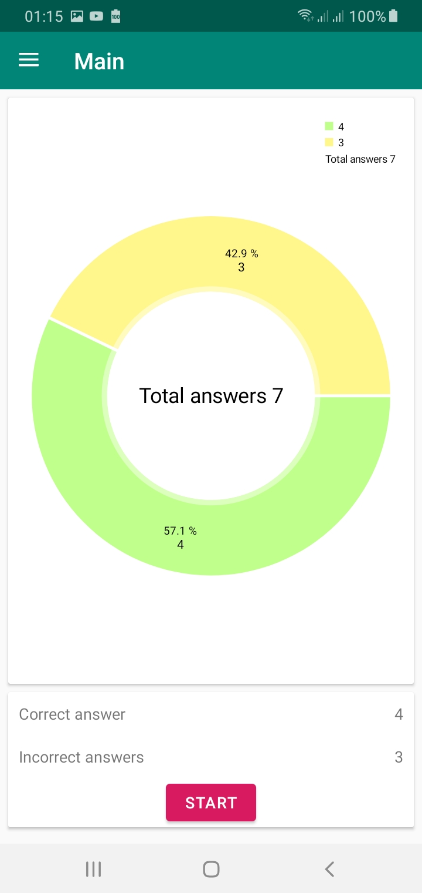
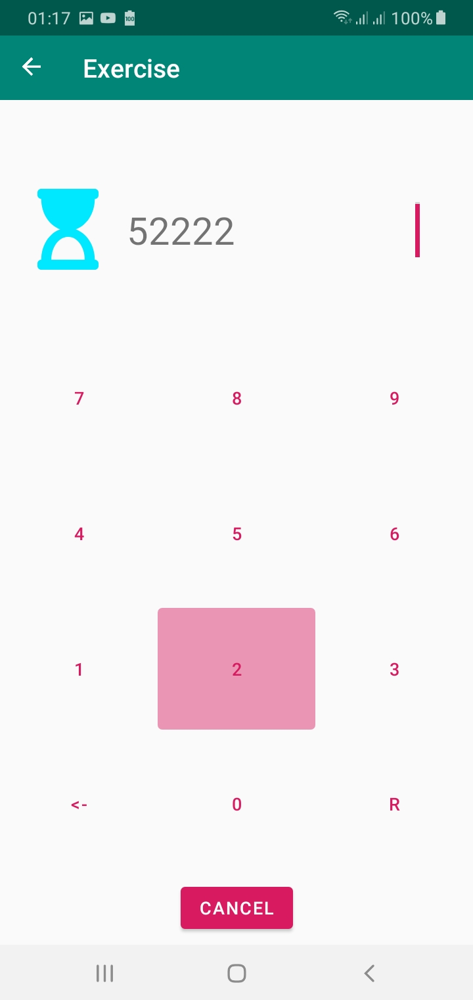
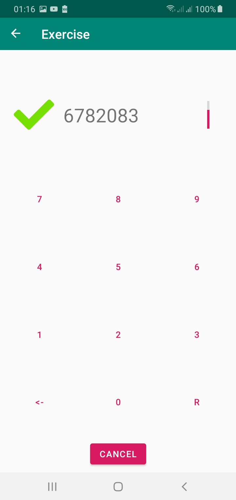
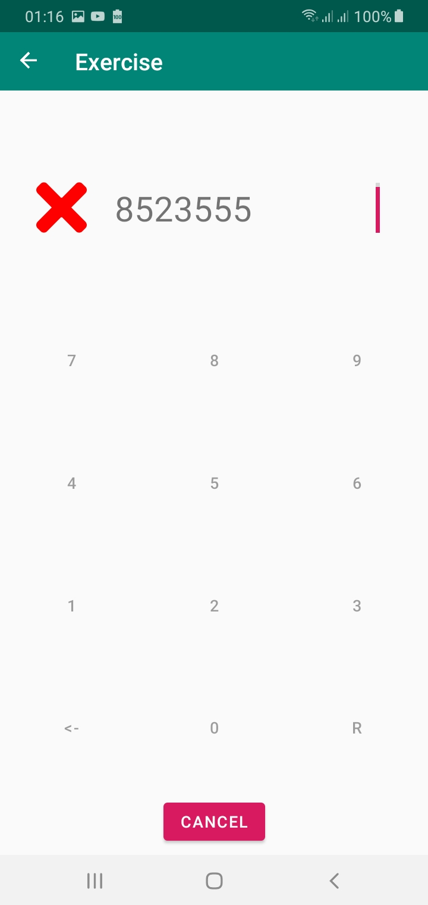
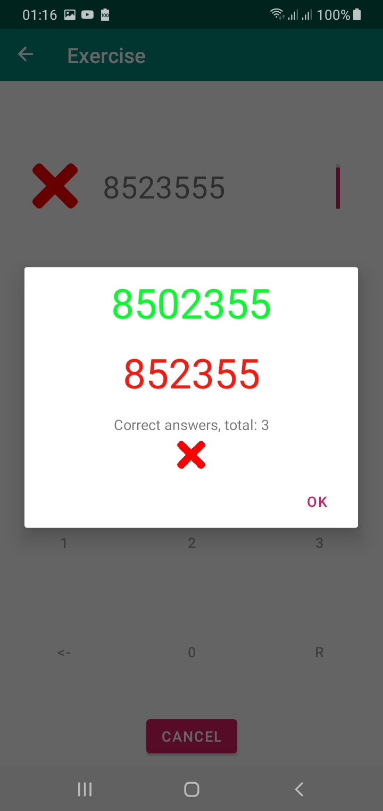

# Nummerals
Numeral Training for English
With audio
While the range is from 1 to 10,000

Need to do:
  1) statistics calculation + graph on the first screen
  2) other ranges
  3) transition logic + show the timer at the beginning
